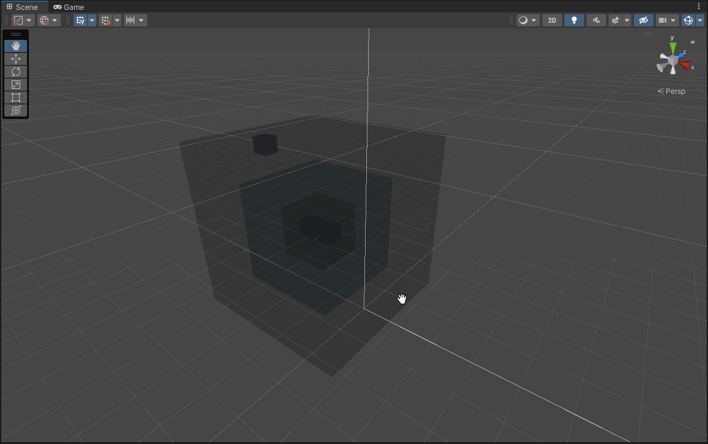
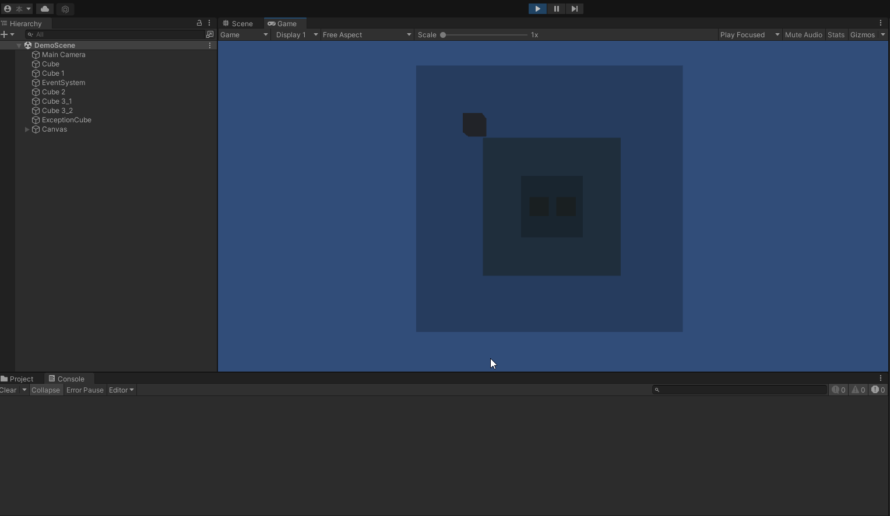

# NestedCollidersDetector

一个在多个碰撞器多层嵌套、遮挡情况下，进行穿透交互的Demo。

# Summary

1. PC下使用，也只有PC有此需求
2. 按键C可清除控制台Log
3. 支持LayerMask配置筛选检测碰撞器。

# How to use?

1.继承RayEventBase

2.注册事件

> 注册事件

```csharp
    public override void Awake()
    {
        base.Awake();
        OnPointerClickCallback = new UnityEvent<PointerEventData>();
        OnPointerClickCallback.AddListener(_OnPointerClick);
        OnPointerEnterCallback = new UnityEvent<PointerEventData>();
        OnPointerEnterCallback.AddListener(_OnPointerEnter);
        OnPointerExitCallback = new UnityEvent<PointerEventData>();
        OnPointerExitCallback.AddListener(_OnPointerExit);
        BaseLayerMask = ~(1 << 10);
    }
```

3.事件逻辑

> 事件逻辑

```csharp
    private void _OnPointerClick(PointerEventData eventData)
    {
        //dosomthing
    }

    private void _OnPointerEnter(PointerEventData eventData)
    {
         //dosomthing
    }

    private void _OnPointerExit(PointerEventData eventData)
    {
         //dosomthing
    }
```

# Demo GIF

>嵌套/遮挡碰撞器层级结构展示：


>交互展示（左上角黑色Cube为LayerMask物体；Log为点击输出）：


# Reference

HighlightingSystem：项目引用了高亮插件，请自行购买导入，如果没有则移除相关代码即可

UniTask

# Roadmap

1.解决与原生Raycast物体相互作用的问题
